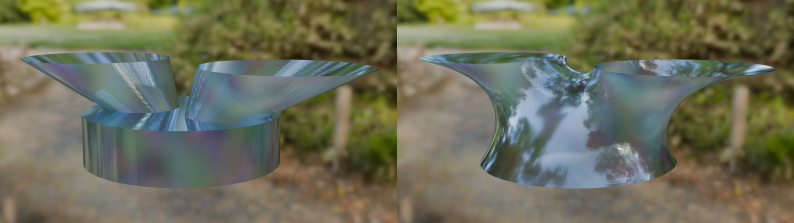

# CSDI Material Point Method



This repository is a Julia implementation of the [Convected Surface Domain Interpolation (CSDI)](https://papers.ssrn.com/sol3/papers.cfm?abstract_id=5352685) method. CSDI is a variant of the Material Point Method (MPM), specialized in modeling certain types of surface forces with $C^0$ particles, namely surface tension and traction.

## Dependencies
### GMSH
The code requires [GMSH](https://gmsh.info) `> v4.0`. The easiest way to install it in a local environment will be to use Python.

Using pip:
```
pip install --upgrade gmsh
```

Using [uv](https://github.com/astral-sh/uv):
```
uv init
uv add gmsh
```

The Python `gmsh` [package](https://pypi.org/project/gmsh) is regularly updated by the GMSH team, which includes a Julia API file (`.venv/lib64/gmsh.jl`). While there is a Julia `Gmsh.jl` package, it is not from the GMSH team and has not been updated in a long time.

### Python

Python is only required for mesh creation (via the `meshers/` scripts) and figure creation in the various notebooks in the `analysis/` directory.

### Julia Packages

The README and the bash scripts all assume that you add these Julia packages to the Main environment.

#### Main Environment

If you do not care about your main Julia environment, the quickest and simplest way to setup the required Julia packages is to run Julia, enter Pkg mode (pressing `]`), then run:
```
add ArgParse Dates Folds LinearAlgebra Logging ProgressMeter Roots StaticArrays WriteVTK
```

#### New Environment

The better option (untested) is to install the packages in this project's environment. Run Julia, enter Pkg mode, then run the following:

```
activate .
instantiate
```

You will then just add the `--project=.` flag to every julia command. As an example: `julia --project=. -t 4 -- examples/CookMembrane.jl`.

## Quick Start

All commands (Julia and Python) should be run in the root directory. If you type `ls` in the console, you should see the `analysis/`, `examples/`, `meshers/`, and `src/` directories.

```
julia -t 4 -- examples/CookMembrane.jl
```

The `-t` or `--threads` flag indicate the number of compute threads Julia will use. The `--` dashes separates Julia-specific flags and arguments for the program file.

## Code Structure

### `src/`

The core logic of the code is in this directory, organized into `2D`, `3D`, and `3DMembrane`. The first two are for modeling bulk-surface interactions, with the bulk using standard CPDI elements (quadrangles and tetrahedrons) and the surface using CSDI elements (lines and triangles). The last one is what our paper calls the "membrane point method", where mass is placed onto the surface with no "bulk".

### `meshers/` and `meshes/`

`meshers/` are a set of Python GMSH scripts to create the meshes in `meshes/`. Each script provide a handful of command line arguments to modify the geometry and/or the mesh density.

Note that each mesh should be located in the first quadrant/octant in the cartesian plane. This is due to how the background grid is implemented (see `src/2D/Grid.jl` and the `Index2DTo1D()` function). If the mesh is not in that region of space, then you will need to modify the vertices of all points in the material/surface domains before calling `getAllConnectedGrid!()`.

### `examples/`

These are various examples that demonstrate the method. Each example is a single file with no command line arguments.

The image at the top of this README is made from `examples/ForkTubes.jl` with the output meshes rendered in Blender.

### `analysis/`

Each directory inside `analysis/` directly maps to the examples shown in our paper. These contain 3 primary files:
- `Main.jl`: The start point of the program. This file manages the command line arguments, validates them, then runs the next file.
- `Example.jl`: This file is named after the directory, which contains the main MPM loop.
- `ProcessData.jl`: A file for post-processing functions.

## Additional Documentation

See the [common errors document](docs/commonErrors.md) if you are having trouble running the program.

If you are running this code in an HPC environment, [this document](docs/installTACC.md) might help you for fixing GMSH related issues.

If you were wondering about some of the architectural decisions I have made for this codebase, you can read about it [here](docs/architectureComments.md).

## Please Cite Us!

If you have found this project useful in your work, we would be immensely grateful if you cited our paper!

```
TODO: add bibtex citation code here.

```
